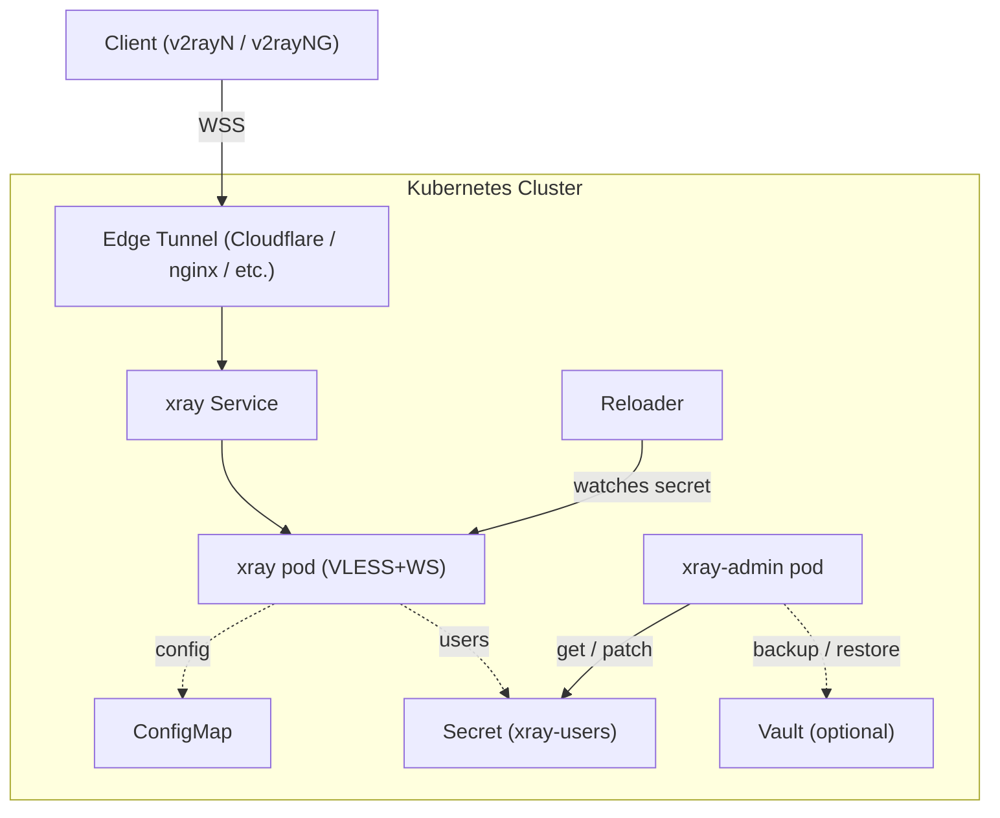

# xray-vless-edge-tunnel

[](https://github.com/noizo/xray-vless-edge-tunnel/actions/workflows/build.yaml)
[](https://github.com/noizo/xray-vless-edge-tunnel/actions/workflows/lint.yaml)
[](https://github.com/noizo/xray-vless-edge-tunnel/actions/workflows/trivy.yaml)
[](https://github.com/noizo/xray-vless-edge-tunnel/actions/workflows/semgrep.yaml)

VLESS proxy with a web admin panel for user management. Designed for Kubernetes clusters with ArgoCD, with optional cloud vault backup for user data.

## Architecture



- **Xray** runs the VLESS+WebSocket proxy using [xtls/xray-core](https://github.com/XTLS/Xray-core)
- **xray-admin** is a Go web app for adding/removing users, generating QR codes, and sharing client configs
- User data is stored in a K8s Secret and optionally synced to an external vault for backup
- [Reloader](https://github.com/stakater/Reloader) watches the secret and triggers a rolling restart of the xray pod on changes

## Prerequisites

- Kubernetes cluster (tested on K3s ARM64, works on any distro)
- Container registry access for the admin image (GHCR by default)
- Ingress controller, reverse proxy, or tunnel (Cloudflare Tunnel, nginx-ingress, Traefik, etc.)

### Optional

- Cloud vault for user data backup/restore (supports OCI Vault via Instance Principal; can be extended)
- Authentication proxy for admin panel (Cloudflare Access, OAuth2 Proxy, etc.)

## Deployment

### ArgoCD (recommended)

Create an ArgoCD Application pointing to this repo:

```yaml
apiVersion: argoproj.io/v1alpha1
kind: Application
metadata:
  name: xray
  namespace: argocd
spec:
  project: default
  source:
    repoURL: https://github.com/noizo/xray-vless-edge-tunnel.git
    targetRevision: HEAD
    path: deployments/kubernetes
  destination:
    server: https://kubernetes.default.svc
    namespace: xray
  syncPolicy:
    automated:
      prune: true
      selfHeal: true
    syncOptions:
      - CreateNamespace=true
  ignoreDifferences:
    - group: ""
      kind: Secret
      name: xray-users
      jsonPointers:
        - /data
        - /stringData
```

The `ignoreDifferences` block prevents ArgoCD from reverting runtime changes to the `xray-users` secret.

### Manual (kubectl)

```bash
kubectl create namespace xray
kubectl apply -k deployments/kubernetes/ -n xray
```

## Configuration

### Xray (VLESS proxy)

Edit `deployments/kubernetes/configmap.yaml` to set your domain:
- `Host` header in WebSocket settings — must match your public hostname
- Port and protocol settings as needed

The `__CLIENTS__` placeholder is replaced at runtime by the init container with the contents of the `xray-users` secret.

### Admin panel

Environment variables in `deployments/kubernetes/admin-deployment.yaml`:

| Variable | Default | Description |
|----------|---------|-------------|
| `NAMESPACE` | `xray` | Kubernetes namespace |
| `SECRET_NAME` | `xray-users` | K8s Secret name for user data |
| `HOST` | `hide.nikolaev.id` | VLESS server hostname shown in client configs |
| `PORT` | `443` | VLESS server port shown in client configs |
| `OCI_VAULT_SECRET_ID` | _(empty)_ | OCI Vault secret OCID for backup; empty disables |

Set `HOST` and `PORT` to match your deployment's public endpoint.

### Vault backup (optional)

If `OCI_VAULT_SECRET_ID` is set, user data is synced to the vault on every change. On startup, if the K8s secret is empty but the vault has data, it auto-restores.

Currently supports OCI Vault with Instance Principal authentication. To add another provider, implement the `SecretBackend` interface in `cmd/admin/backup.go` and register it in `initBackend()`.

To disable vault integration entirely, remove `admin-vault-config.yaml` from `kustomization.yaml` and the `envFrom` block from `admin-deployment.yaml`.

## User management

### Web UI

Access the admin panel at your configured domain. The UI supports:
- Adding users (generates UUID automatically)
- Removing users
- Sharing client configs via QR code or VLESS link
- Direct deep-links for v2rayNG (Android)

### CLI (`scripts/xray-users.sh`)

Terminal tool for managing users without the web UI:

```bash
# Add a user
./scripts/xray-users.sh seek <name>

# Remove a user
./scripts/xray-users.sh hide <name>

# Remove all users
./scripts/xray-users.sh obliterate

# Show QR code and share link for a user
./scripts/xray-users.sh share <name>
```

Requires `kubectl`, `jq`, and `qrencode`.

## CI/CD

| Workflow | Trigger | Description |
|----------|---------|-------------|
| `build` | push to main (`cmd/admin/**`, `Dockerfile`) | Build and push ARM64 image to GHCR |
| `lint` | push/PR to main | ShellCheck, golangci-lint, govulncheck, actionlint, kubeconform |
| `trivy` | push/PR to main | IaC misconfiguration and secret scanning |
| `semgrep` | push/PR to main | SAST analysis |

The Docker image is built for `linux/arm64`. To build for other architectures, update the `platforms` field in `.github/workflows/build.yaml`.

## Local development

The admin app requires Kubernetes API access (in-cluster config):

```bash
cd cmd/admin
NAMESPACE=xray SECRET_NAME=xray-users HOST=example.com PORT=443 go run .
```

For local development, use `telepresence` or modify the code to use `clientcmd` for out-of-cluster access.

### Manual image build

```bash
docker build --platform linux/arm64 -t ghcr.io/noizo/xray-vless-edge-tunnel:latest .
docker push ghcr.io/noizo/xray-vless-edge-tunnel:latest
```

## RBAC

The admin pod runs with a dedicated `xray-admin` ServiceAccount with minimal permissions:
- Get/Update/Patch the `xray-users` Secret

Defined in `deployments/kubernetes/admin-rbac.yaml`.

## License

[Apache License 2.0](LICENSE)
